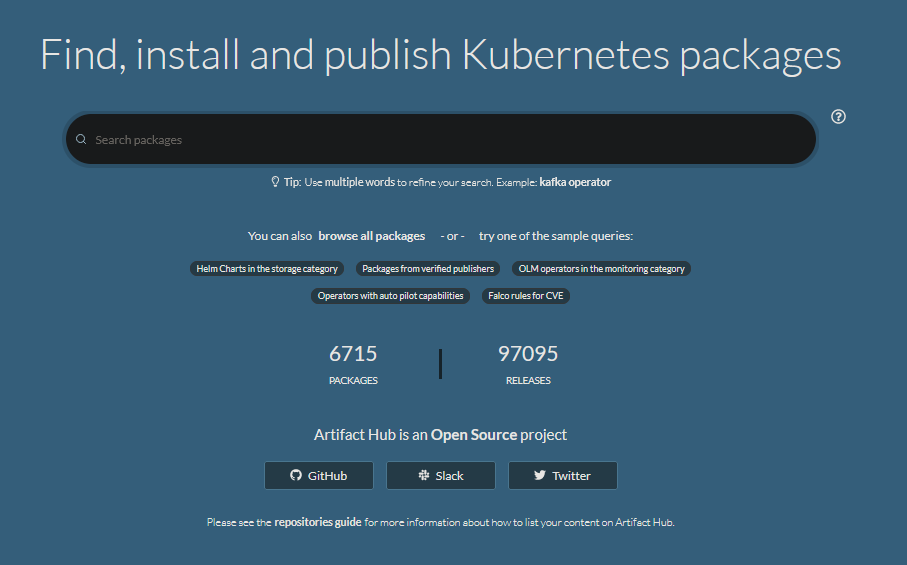
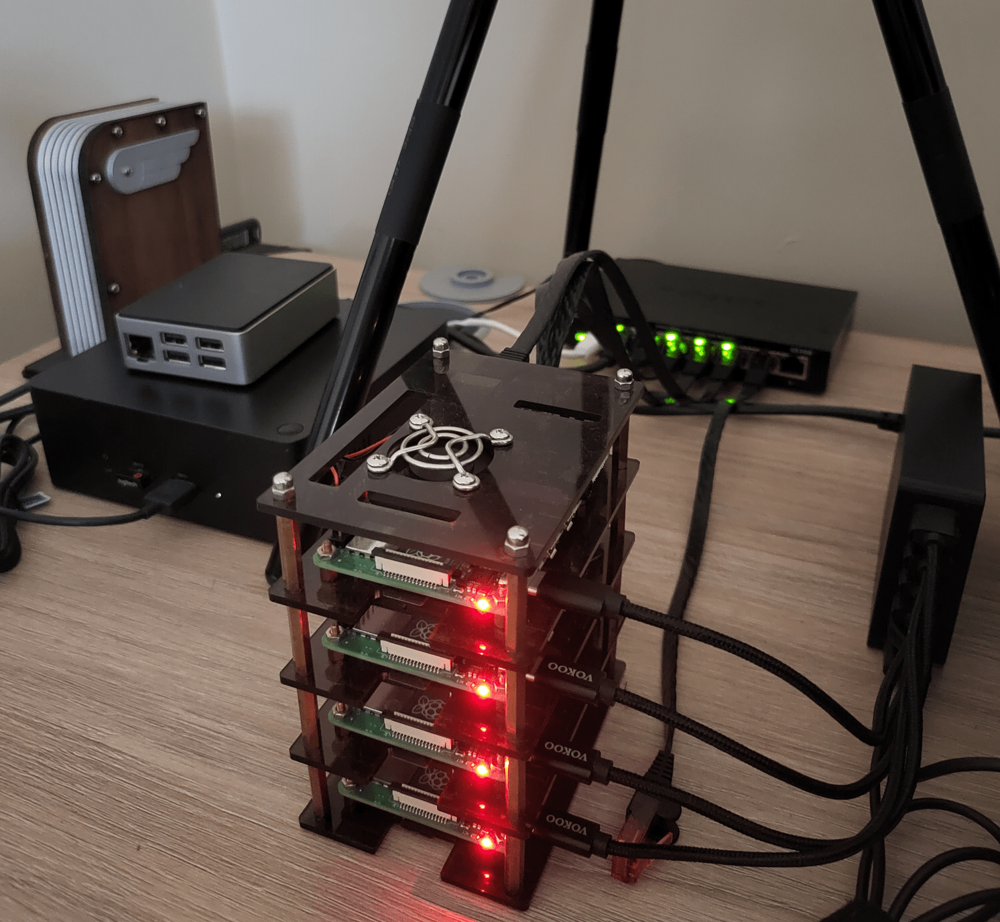

## Deploying SQL Server to Kubernetes using Helm

---

## Andrew Pruski

### SQL Server DBA, Microsoft Data Platform MVP, & Certified Kubernetes Administrator
<!-- .slide: style="text-align: left;"> -->
<i class="fab fa-twitter"></i><a href="https://twitter.com/dbafromthecold">  @dbafromthecold</a> 
<i class="fas fa-envelope"></i>  dbafromthecold@gmail.com 
<i class="fab fa-wordpress"></i>  www.dbafromthecold.com 
<i class="fab fa-github"></i><a href="https://github.com/dbafromthecold">  github.com/dbafromthecold.com</a>

---

### Session Aim
<!-- .slide: style="text-align: left;"> -->
To provide an overview of Helm and how it can be used to deploy applications (SQL Server) to Kubernetes

---

### Agenda
<!-- .slide: style="text-align: left;"> -->
- An overview of Helm 
- How to deploy an application (SQL Server) to Kubernetes using Helm 
- Upgrading an application using Helm 
- Rolling back an upgrade using Helm 
- Chart Repositories

---

### What is Helm?
<!-- .slide: style="text-align: left;"> -->

<a href="https://helm.sh/">https://helm.sh/</a> 

<!-- .slide: style="text-align: right;"> -->
A package manager for Kubernetes 
Charts help define Kubernetes applications 
With Helm you can: - 
Mange complexity 
Easily update and rollback 
Share charts 

---

### History of Helm
<!-- .slide: style="text-align: left;"> -->

Helm was created in 2015 at Deis 
Helm Classic was introduced at KubeCon in November 2015 
Helm Classic was merged with Google's Deployment Manager in January 2016 
Open source at github at https://github.com/helm/helm 
More than 2 million downloads a month 
Graduated status within the CNCF in April 2020 

---

### Helm Hub

---

### My Raspberry Pi Kubernetes Cluster
<!-- .slide: style="text-align: left;"> -->

<a href="https://dbafromthecold.com/2020/11/30/building-a-raspberry-pi-cluster-to-run-azure-sql-edge-on-kubernetes/">Building a Raspberry Pi cluster to run Azure SQL Edge on Kubernetes</a> 

---

# Demos

---

## Resources
<!-- .slide: style="text-align: left;"> -->

<a href="https://github.com/dbafromthecold/SQLServerKubernetesHelm">https://github.com/dbafromthecold/SQLServerKubernetesHelm</a> 
